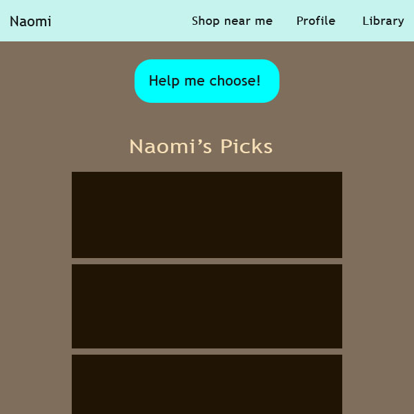
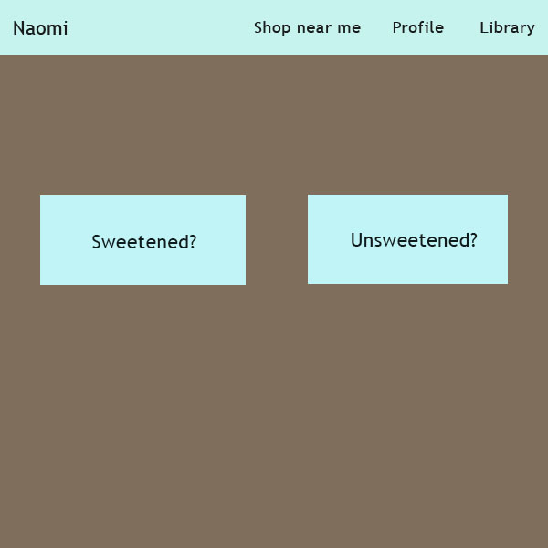

# coffee-app
This project was pair-programmed with Ben Gimbel, a classmate, and I have since reformatted the original app. It's built on Node and Express, with a Mongo database. I recently streamlined the views to reduce redirection, adding an input selector in place of a view for each of the app's functions (drink recommendations, drink history, and drink library). This helped clean up the design in addition to reducing unnecessary re-renders.

Run at https://yourcup.herokuapp.com/user/register

The idea behind this project came from many experiences as a barista where I was confronted with "What should I get?" from customers at the register. Because there can be a sense of mystery and exclusivity in the coffee business, many people, including me before I began working in the industry, have trouble sorting through the fancy-sounding drinks in a cafe's menu. This app helps the indecisive user make a selection and the unknowledgable user navigate through the confusing lingo.

